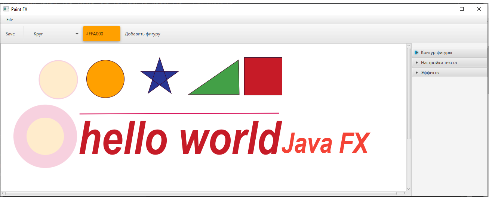

### Приложение Paint на JavaFX и SpringBoot
Java 11
SpringBoot 2.7.16
#### Описание

Это небольшое приложение Paint, созданное на JavaFX и Spring. Приложение позволяет пользователю создавать простые фигуры.
Можно указать толщину линии, цвет линии и фигуры, прозрачность. Есть возможность сохранить полученное изображение.
#### Фигуры:
* Квадрат;
* Окружность;
* Линия;
* Звезда;
* Текст;
* Изображение .png или .jpeg;
* Треугольник.

#### Примеры:
